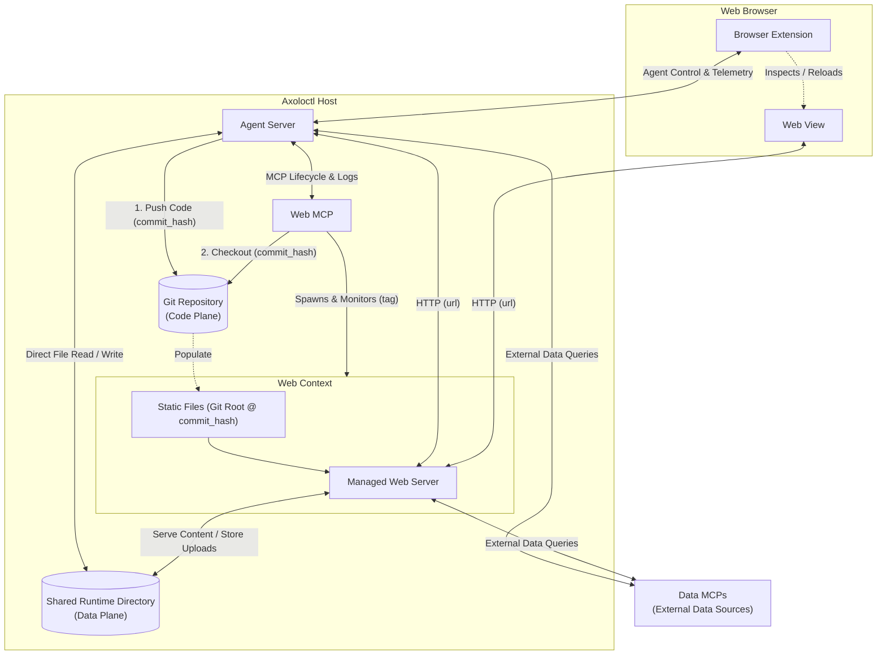
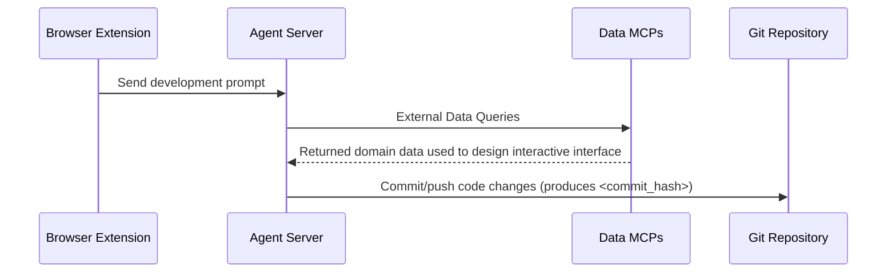
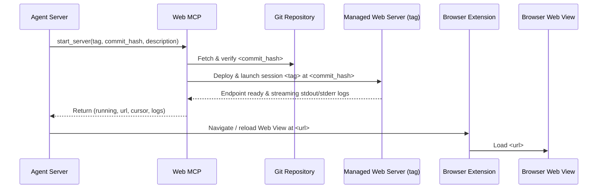
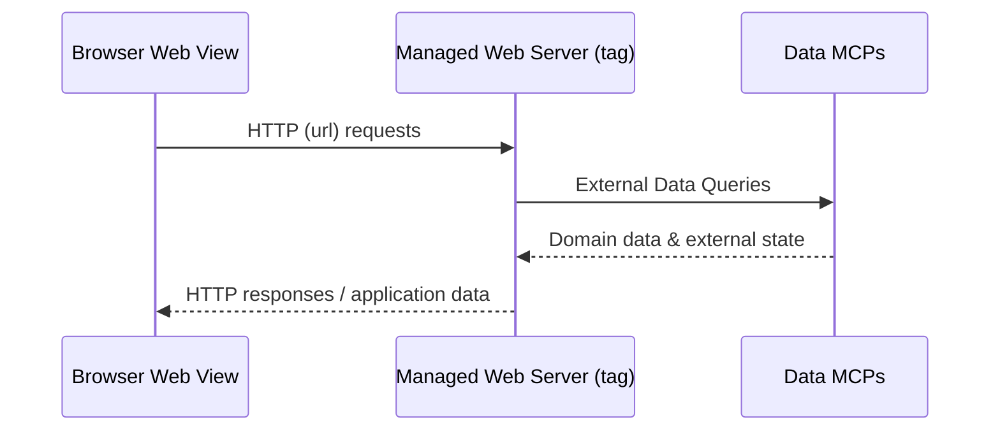
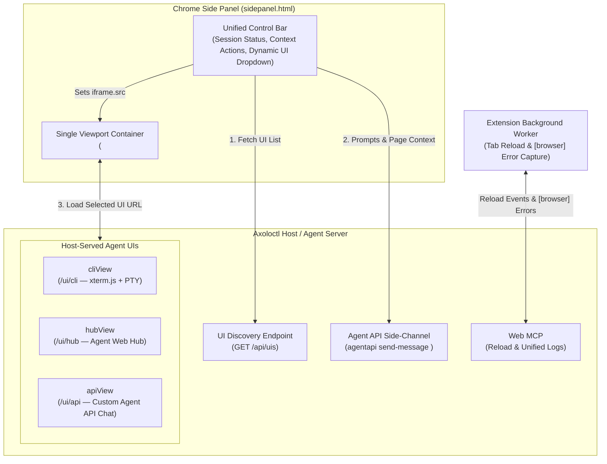

[**UDMI**](../../) / [**MCP**](../) / [Axoloctl](#)

# Axoloctl — Git-Backed Web Server Lifecycle MCP Server

`axoloctl` is a Model Context Protocol (MCP) server that enables an Agent to manage the lifecycle of one or more remote or local web server sessions in a deterministic, controlled environment.

Rather than running ad-hoc shell commands against a mutable working tree, the backing code for each web server is provided through an out-of-band Git mechanism. The Agent commits/pushes code changes to Git and calls `start_server(tag, commit_hash, description)`. `axoloctl` deploys that exact immutable revision under the specified `tag`, returns the immutable access `url`, manages the session lifecycle (`stop_server`, `get_status`, `list_servers`), and streams back the session's web server logs (`read_logs`).

---

## Objective

1. **Multi-Session Lifecycle Management**: Address each web server session by a caller-supplied `tag` and list active sessions with their `tag` and human-readable `description`.
2. **Immutable Code Deployment via Git Hash**: Deploy an explicit, verifiable Git commit SHA (`commit_hash`) fetched from the backing repository, queryable via `get_status`.
3. **Immutable Access URL on Startup**: Return the complete, immutable access `url` exclusively from `start_server` when a session is launched.
4. **Structured Log Streaming**: Allow the Agent to incrementally read and stream `stdout`/`stderr` logs for a specific `tag` using cursor-based pagination.

---

## System Architecture

The `axoloctl` system separates the **Code Plane** (immutable web server code and static assets delivered via Git `commit_hash` via the internal **Web MCP**) from the **Data Plane** (a dynamic **Shared Runtime Directory** inside the **Axoloctl Host** paired with external **Data MCPs** representing external data sources):



### Code Plane vs. Data Plane

The web server environment is partitioned into two distinct planes:

1. **Code Plane — Static Files (`Git Root @ commit_hash`)**:
   * Corresponds to the root of the Git repository hierarchy where the web server application and static assets live.
   * Provisioned immutably by the **Web MCP** (`axoloctl`) when `start_server(tag, commit_hash, description)` checks out the target `commit_hash`.
   * Modifying the web server logic or static bundle requires committing to Git and passing the new `commit_hash` to `start_server`.
2. **Data Plane — Shared Runtime Directory & External Data MCPs**:
   * **Shared Runtime Directory**: A dynamic runtime directory mounted/shared between the **Agent Server** and the **Managed Web Server** inside the **Axoloctl Host**.
     * **Agent $\rightarrow$ Web Server**: The **Agent Server** can directly create or update files in the shared runtime directory (including data fetched from external **Data MCPs**) so the **Managed Web Server** immediately serves dynamic content without requiring a Git commit or server restart.
     * **Web Server $\rightarrow$ Agent**: Files uploaded or generated via the **Managed Web Server** (e.g., user uploads from the **Web View**) are written to the shared runtime directory where the **Agent Server** can directly read and process them.
   * **Data MCPs (`External Data Sources`)**: External MCP servers located outside the **Axoloctl Host** that provide both the **Agent Server** and the **Managed Web Server** with access to external data sources, APIs, and domain services.

### Components

* **Axoloctl Host**:
  * **Agent Server**: Queries external data sources via the **Data MCPs**, commits/pushes application code changes to the Git repository (**Code Plane**), reads/writes dynamic artifacts in the **Shared Runtime Directory** (**Data Plane**), manages the web server lifecycle through the **Web MCP**, connects to the **Managed Web Server** over `HTTP (url)`, and communicates with the **Browser Extension**.
  * **Web MCP (`axoloctl`)**: Fetches the requested `commit_hash` from Git and manages the **Web Context** for each session `tag`.
  * **Web Context**: Isolated runtime context managed by the **Web MCP** that binds the immutable **Static Files (`Git Root @ commit_hash`)** and the dynamic **Shared Runtime Directory** to the **Managed Web Server** (`HTTP (url)` endpoint for both the **Agent Server** and the **Web View**, with direct connectivity to external **Data MCPs**).
* **Data MCPs (`External Data Sources`)**: External MCP interfaces providing domain data and external system state to both the **Agent Server** and the **Managed Web Server**.
* **Web Browser**:
  * **Web View**: Connects to the **Managed Web Server** over `HTTP (url)` to render the web application and upload/download data-plane content.
  * **Browser Extension**: Connects directly to the **Agent Server** to coordinate browser navigation, page reloads, and client-side telemetry on the **Web View**.

---

## Lifecycle Workflow

### 1. Development



* **Browser Extension $\rightarrow$ Agent Server**: Sends a development prompt to the **Agent Server**.
* **Agent Server $\rightarrow$ Data MCPs**: Executes external data queries against external data sources.
* **Data MCPs $\rightarrow$ Agent Server**: Returned domain data used to design interactive interface.
* **Agent Server $\rightarrow$ Git Repository**: Commits and pushes code changes to produce `<commit_hash>`.

### 2. Deployment



* **Agent Server $\rightarrow$ Web MCP**: Calls `start_server(tag, commit_hash, description)`.
* **Web MCP $\rightarrow$ Git Repository**: Fetches and verifies `<commit_hash>`.
* **Web MCP $\rightarrow$ Managed Web Server (`tag`)**: Deploys and launches session `<tag>` at `<commit_hash>`, waits for the endpoint to become ready, and returns `(running, url, cursor, logs)` to the **Agent Server**.
* **Agent Server $\rightarrow$ Browser Extension $\rightarrow$ Browser Web View**: Instructs the **Browser Extension** to navigate or reload the **Browser Web View** at `<url>`.

### 3. Ongoing Use



* **Browser Web View $\rightarrow$ Managed Web Server (`tag`)**: Sends `HTTP (url)` requests directly to the running web server.
* **Managed Web Server (`tag`) $\leftrightarrow$ Data MCPs**: Queries external data sources and domain services and receives domain data and external state.
* **Managed Web Server (`tag`) $\rightarrow$ Browser Web View**: Returns rendered `HTTP` responses and application data to the browser.

---

## MCP Tool Interface

`axoloctl` exposes five canonical MCP tools:

### 1. `start_server`
Deploys the specified Git commit hash for the given session `tag` and starts the web server via `bin/serve`. If a session with the same `tag` is already running, `start_server` cleanly stops the existing instance before starting the new revision on the same sticky port and `url`.

* **Arguments**:
  * `tag` (`string`, **required**): Unique identifier for the web server session (e.g., `"ui-dev"`, `"pr-42"`).
  * `commit_hash` (`string`, **required**): The 40-character hexadecimal Git commit SHA (`^[0-9a-f]{40}$`) of the code to run.
  * `description` (`string`, **required**): Human-readable description of the web server session (returned by `list_servers`).
* **Returns**:
  * `running` (`boolean`): `true` when the web server session passes the readiness probe (`HTTP GET <url>` status `< 500`); `false` if startup fails or times out.
  * `url` (`string | null`): Complete, immutable, sticky URL assigned to the session `tag` (returned only by `start_server`; `null` if startup fails).
  * `cursor` (`integer`): Initial log cursor position after startup.
  * `logs` (`string[]`): Initial startup log lines captured during launch (or failure diagnostics if `running` is `false`).

### 2. `stop_server`
Stops the running web server session identified by `tag` while preserving its per-tag **Shared Runtime Directory** (`<shared_root>/<tag>/`) and sticky port assignment for future restarts.

* **Arguments**:
  * `tag` (`string`, **required**): Session identifier of the web server to stop.
* **Returns**:
  * `running` (`boolean`): `false`.
  * `exit_code` (`integer | null`): Exit status code of the terminated server session.
  * `logs` (`string[]`): Trailing log lines emitted during shutdown.

### 3. `get_status`
Returns the current lifecycle state and deployed `commit_hash` of the web server session identified by `tag`.

* **Arguments**:
  * `tag` (`string`, **required**): Session identifier of the web server to query.
* **Returns**:
  * `running` (`boolean`): Whether the web server session is currently active.
  * `commit_hash` (`string`): Git commit SHA of the session (returned only by `get_status`).
  * `exit_code` (`integer | null`): Exit status code if the server session has stopped.

### 4. `list_servers`
Lists all currently active remote web server sessions.

* **Arguments**: None (`{}`)
* **Returns**:
  * `servers` (`object[]`): Array of active server session summaries, each containing:
    * `tag` (`string`): Session identifier.
    * `description` (`string`): Description provided when the session was started.

### 5. `read_logs`
Streams captured unified log lines (`[server]` `stdout`/`stderr` from `bin/serve` and `[browser]` client-side console/runtime errors forwarded from the **Web View**) for the session identified by `tag` starting from a line offset cursor.

* **Arguments**:
  * `tag` (`string`, **required**): Session identifier of the web server whose logs are being read.
  * `cursor` (`integer`, optional, default `0`): Zero-based line offset returned as `next_cursor` (or `cursor` from `start_server`) from a previous call.
  * `max_lines` (`integer`, optional, default `200`): Maximum number of log lines to return in a single call.
* **Returns**:
  * `running` (`boolean`): Whether the web server session is currently active.
  * `lines` (`string[]`): Unified `[server]` and `[browser]` log lines from `cursor` up to `cursor + max_lines`.
  * `next_cursor` (`integer`): Updated cursor offset for subsequent incremental `read_logs` calls.

---

## Runtime & Boundary Specifications

### 1. Web Context Execution Contract
* **Read-Only Code Plane**: When `start_server(tag, commit_hash, description)` is invoked, `Web MCP` checks out `<commit_hash>` into an isolated session code directory (`<runtime_root>/sessions/<tag>/code`) and marks the tree read-only (`chmod -R a-w`). Any runtime file writes attempted inside the Code Plane fail immediately at the OS level, enforcing that mutable state goes to the Data Plane.
* **Canonical Entrypoint (`bin/serve`)**: `Web MCP` executes `./bin/serve` from the root of the read-only `<commit_hash>` checkout. If `bin/serve` is missing or not executable, `start_server` fails immediately.
* **Environment Variables**: `Web MCP` injects the following canonical environment variables into the `bin/serve` process:
  * `AXOLOCTL_PORT`: Local TCP port assigned to `tag`.
  * `AXOLOCTL_DATA_DIR`: Absolute path to the session's persistent **Shared Runtime Directory** (`<shared_root>/<tag>/`).
  * `AXOLOCTL_MCP_PROXY_URL`: Base HTTP URL of the host's local HTTP-to-MCP proxy for invoking external **Data MCPs**.
  * `AXOLOCTL_TAG`: Active session identifier (`tag`).
  * `AXOLOCTL_COMMIT`: Deployed 40-character hexadecimal Git commit SHA (`commit_hash`).

### 2. Sticky URL & Port Allocation per `tag`
* Each session `tag` is assigned a sticky local port (`AXOLOCTL_PORT`) and access `url` that remains constant across `start_server` redeployments and across `stop_server` / restart cycles for the same `tag`.
* Keeping the origin (`url`) invariant across iterative commits preserves browser state (`localStorage`, session cookies, DevTools state) and allows the **Browser Extension** to reload the **Web View** in place.

### 3. Per-Tag Shared Runtime Directory (`Data Plane`) Lifecycle
* The **Shared Runtime Directory** is scoped per session `tag` at `<shared_root>/<tag>/` and exposed to both the **Agent Server** and the **Managed Web Server** (`AXOLOCTL_DATA_DIR`).
* **Persistence**: Contents of `<shared_root>/<tag>/` are preserved across `start_server` code redeployments (which replace only the read-only `code/` directory) and across `stop_server(tag)` invocations, ensuring uploaded files, cached query results, and application state survive iterative development.

### 4. Data MCP Connectivity (`AXOLOCTL_MCP_PROXY_URL`)
* To allow both the **Agent Server** and the **Managed Web Server** to query external **Data MCPs** concurrently without `stdio` pipe contention or requiring an MCP client SDK inside every web app, the **Axoloctl Host** exposes a local HTTP-to-MCP bridge at `AXOLOCTL_MCP_PROXY_URL`.
* The **Managed Web Server** invokes **Data MCP** tools via standard HTTP JSON requests (`POST ${AXOLOCTL_MCP_PROXY_URL}/<mcp_server>/<tool_name>`) and receives structured JSON responses.

### 5. Readiness Probe & Startup Failure Semantics
* After spawning `bin/serve`, `Web MCP` polls `HTTP GET <url>` (succeeding on any HTTP status `< 500`) for up to a fixed startup timeout (`10 seconds`) while monitoring the child PID.
* If `bin/serve` exits prematurely or fails to respond with HTTP `< 500` within `10 seconds`, `Web MCP` terminates the process tree and returns `{ running: false, url: null, cursor, logs }` containing the captured `stdout`/`stderr` output so the **Agent Server** can immediately diagnose the startup failure.

### 6. Browser Extension Integration & Unified Log Stream
* **Control Channel**: The **Browser Extension** connects directly to the **Agent Server** to accept navigation and page-reload commands after `start_server` succeeds.
* **Unified Telemetry (`[server]` + `[browser]`)**: Client-side runtime errors (`console.error`, uncaught exceptions, failed resource loads) captured from the **Web View** are forwarded into the session's log buffer with a `[browser]` prefix alongside `[server]` `stdout`/`stderr` lines, allowing `read_logs(tag)` to provide a single, time-ordered diagnostic stream.

---

## Browser Extension $\leftrightarrow$ Agent Server Integration

The **Browser Extension** is a **static Chrome Extension (Manifest V3 Side Panel)** designed to provide a clean, user-friendly interface without exposing developer-only tools (such as Chrome DevTools) and without ever requiring updates when the **Managed Web Server** application pages or the **Agent UIs** evolve.

Rather than hardcoding specific UI implementations inside the extension bundle, the **Axoloctl Host** exposes a dynamic catalog of available Agent UIs (`GET /api/uis` — e.g., `{ cliView, hubView, apiView }`), and the Chrome Side Panel renders a dynamic dropdown selector above a **single `<iframe id="agent-viewport">`**.



### 1. Invariant Extension Layer (Shared Across All UIs)
Because the Chrome Extension only hosts the control bar, the single `<iframe id="agent-viewport">`, and the background service worker, three core mechanisms operate identically regardless of which UI is selected:
1. **Dynamic UI Discovery (`GET /api/uis`)**:
   * On startup, the Side Panel fetches the list of available UIs from the **Axoloctl Host**:
     ```json
     {
       "default_ui": "cliView",
       "uis": [
         { "id": "cliView", "label": "CLI Console", "url": "http://localhost:8080/ui/cli" },
         { "id": "hubView", "label": "Web Hub", "url": "http://localhost:8080/ui/hub" },
         { "id": "apiView", "label": "Custom Chat (Agent API)", "url": "http://localhost:8080/ui/api" }
       ]
     }
     ```
   * The extension populates its `<select>` dropdown from `uis` and binds the selected entry's `url` directly to `<iframe id="agent-viewport">`. If `uis` contains only a single entry (`uis.length === 1`), the dropdown selector is automatically hidden and that single UI candidate is loaded directly. Adding, removing, or modifying a UI on the host requires **zero changes to the Chrome Extension**.
2. **`agentapi` Side-Channel (`agentapi send-message <conversation-id>`)**:
   * All host-served UIs (`cliView`, `hubView`, `apiView`) attach to the same active `<conversation-id>` on the **Agent Server**.
   * When the extension's control bar sends page context or prompts via the `agentapi` side-channel, the active conversation updates immediately in whichever UI is currently loaded in the `<iframe>`.
3. **Automatic Tab Reload & `[browser]` Error Capture**:
   * The extension's background worker listens for `start_server` deployment events to reload/navigate the primary **Web View** tab and streams client-side `console.error` / uncaught exceptions to `Web MCP` (`[browser]` prefix in `read_logs(tag)`).

### 2. Pluggable Host-Served UI Implementations (`{ cliView, hubView, apiView }`)

| UI ID | Host Endpoint | Underlying Mechanism | Strengths |
| :--- | :--- | :--- | :--- |
| **`cliView`** | `/ui/cli` | Host serves an `xterm.js` terminal page connected over WebSocket to the **Agent CLI** PTY. | 100% CLI feature parity; focused stream of agent actions without extra navigation chrome. |
| **`hubView`** | `/ui/hub` | Proxies/serves the native **Agent Web Hub** (framed via a static Manifest V3 `declarativeNetRequest` rule). | Complete rich GUI (Markdown, Mermaid diagrams, artifacts, interactive `ask_question` modals) with zero UI re-implementation. |
| **`apiView`** | `/ui/api` | Host serves a streamlined, custom HTML/JS chat page powered by the **Agent API** (`agentapi`). | Purpose-built, simplified user interface tailored specifically for non-developer audiences. |

---

## Fail-Fast Guarantees

* **No Implicit Branch or `HEAD` Fallbacks**: `start_server` requires an explicit 40-character Git commit hash (`commit_hash`). Symbolic refs (such as `HEAD` or branch names) and missing commits are rejected immediately with an error.
* **Mandatory Canonical Entrypoint**: If the checked-out `commit_hash` does not contain an executable `bin/serve` at the repository root, `start_server` fails immediately without falling back to generic static file serving.
* **Unknown Session Tag Rejection**: Calling `stop_server`, `get_status`, or `read_logs` with an unknown `tag` fails immediately with an explicit error.
* **Startup Readiness Verification**: `start_server` verifies that the web server session responds to `HTTP GET <url>` (`status < 500`) within the `10s` startup timeout window; if startup fails, `start_server` terminates the process and returns `{ running: false, url: null, cursor, logs }`.
* **Explicit Stop Semantics**: Calling `stop_server` for a `tag` that is not currently running fails immediately with an explicit error rather than silently succeeding.
