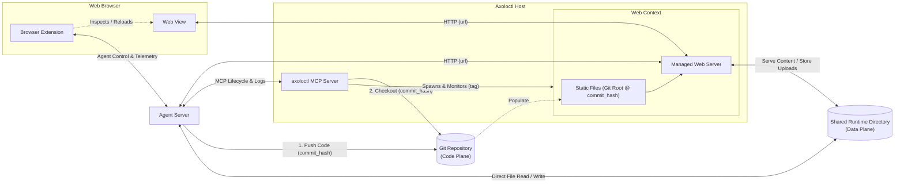
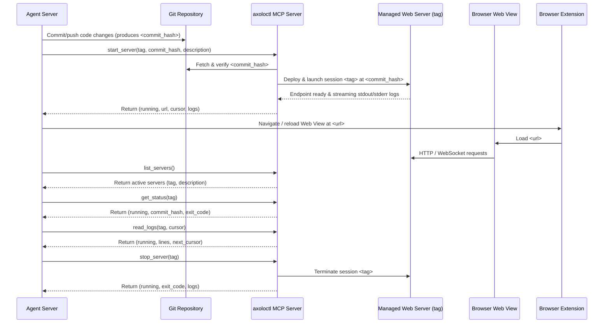

[**UDMI**](../../) / [**MCP**](../) / [Axoloctl](#)

# Axoloctl — Git-Backed Web Server Lifecycle MCP Server

`axoloctl` is a Model Context Protocol (MCP) server that enables an Agent to manage the lifecycle of one or more remote or local web server sessions in a deterministic, controlled environment.

Rather than running ad-hoc shell commands against a mutable working tree, the backing code for each web server is provided through an out-of-band Git mechanism. The Agent commits/pushes code changes to Git and calls `start_server(tag, commit_hash, description)`. `axoloctl` deploys that exact immutable revision under the specified `tag`, returns the immutable access `url`, manages the session lifecycle (`stop_server`, `get_status`, `list_servers`), and streams back the session's web server logs (`read_logs`).

---

## Objective

1. **Multi-Session Lifecycle Management**: Address each web server session by a caller-supplied `tag` and list active sessions with their `tag` and human-readable `description`.
2. **Immutable Code Deployment via Git Hash**: Deploy an explicit, verifiable Git commit SHA (`commit_hash`) fetched from the backing repository, queryable via `get_status`.
3. **Immutable Access URL on Startup**: Return the complete, immutable access `url` exclusively from `start_server` when a session is launched.
4. **Structured Log Streaming**: Allow the Agent to incrementally read and stream `stdout`/`stderr` logs for a specific `tag` using cursor-based pagination.

---

## System Architecture

The `axoloctl` system separates the **Code Plane** (immutable web server code and static assets delivered via Git `commit_hash`) from the **Data Plane** (a dynamic **Shared Runtime Directory** accessible to both the **Agent Server** and the **Managed Web Server**):

### Code Plane vs. Data Plane

The web server environment is partitioned into two distinct planes:

1. **Code Plane — Static Files (`Git Root @ commit_hash`)**:
   * Corresponds to the root of the Git repository hierarchy where the web server application and static assets live.
   * Provisioned immutably by `axoloctl` when `start_server(tag, commit_hash, description)` checks out the target `commit_hash`.
   * Modifying the web server logic or static bundle requires committing to Git and passing the new `commit_hash` to `start_server`.
2. **Data Plane — Shared Runtime Directory**:
   * A dynamic runtime directory mounted/shared between the **Agent Server** and the **Managed Web Server** inside the **Web Context**.
   * **Agent $\rightarrow$ Web Server**: The **Agent Server** can directly create or update files in the shared runtime directory so the **Managed Web Server** immediately serves dynamic content without requiring a Git commit or server restart.
   * **Web Server $\rightarrow$ Agent**: Files uploaded or generated via the **Managed Web Server** (e.g., user uploads from the **Web View**) are written to the shared runtime directory where the **Agent Server** can directly read and process them.

### Components

* **Agent Server**: Commits/pushes application code changes to the Git repository (**Code Plane**), reads/writes dynamic artifacts in the **Shared Runtime Directory** (**Data Plane**), manages the web server lifecycle through `axoloctl`, connects to the **Managed Web Server** over `HTTP (url)`, and communicates with the **Browser Extension**.
* **Axoloctl Host**:
  * **`axoloctl` MCP Server**: Fetches the requested `commit_hash` from Git and manages the **Web Context** for each session `tag`.
  * **Web Context**: Isolated runtime context managed by the **`axoloctl` MCP Server** that binds the immutable **Static Files (`Git Root @ commit_hash`)** and the dynamic **Shared Runtime Directory** to the **Managed Web Server** (`HTTP (url)` endpoint for both the **Agent Server** and the **Web View**).
* **Web Browser**:
  * **Web View**: Connects to the **Managed Web Server** over `HTTP (url)` to render the web application and upload/download data-plane content.
  * **Browser Extension**: Connects directly to the **Agent Server** to coordinate browser navigation, page reloads, and client-side telemetry on the **Web View**.

---

## Lifecycle Workflow

---

## MCP Tool Interface

`axoloctl` exposes five canonical MCP tools:

### 1. `start_server`
Deploys the specified Git commit hash for the given session `tag` and starts the web server. If a session with the same `tag` is already running, `start_server` cleanly stops the existing instance before starting the new revision.

* **Arguments**:
  * `tag` (`string`, **required**): Unique identifier for the web server session (e.g., `"ui-dev"`, `"pr-42"`).
  * `commit_hash` (`string`, **required**): The 40-character hexadecimal Git commit SHA (`^[0-9a-f]{40}$`) of the code to run.
  * `description` (`string`, **required**): Human-readable description of the web server session (returned by `list_servers`).
* **Returns**:
  * `running` (`boolean`): `true` when the web server session is active and reachable.
  * `url` (`string`): Complete, immutable URL used to access the web server session (returned only by `start_server`).
  * `cursor` (`integer`): Initial log cursor position after startup.
  * `logs` (`string[]`): Initial startup log lines captured during launch.

### 2. `stop_server`
Stops the running web server session identified by `tag`.

* **Arguments**:
  * `tag` (`string`, **required**): Session identifier of the web server to stop.
* **Returns**:
  * `running` (`boolean`): `false`.
  * `exit_code` (`integer | null`): Exit status code of the terminated server session.
  * `logs` (`string[]`): Trailing log lines emitted during shutdown.

### 3. `get_status`
Returns the current lifecycle state and deployed `commit_hash` of the web server session identified by `tag`.

* **Arguments**:
  * `tag` (`string`, **required**): Session identifier of the web server to query.
* **Returns**:
  * `running` (`boolean`): Whether the web server session is currently active.
  * `commit_hash` (`string`): Git commit SHA of the session (returned only by `get_status`).
  * `exit_code` (`integer | null`): Exit status code if the server session has stopped.

### 4. `list_servers`
Lists all currently active remote web server sessions.

* **Arguments**: None (`{}`)
* **Returns**:
  * `servers` (`object[]`): Array of active server session summaries, each containing:
    * `tag` (`string`): Session identifier.
    * `description` (`string`): Description provided when the session was started.

### 5. `read_logs`
Streams captured `stdout` and `stderr` log lines for the session identified by `tag` starting from a line offset cursor.

* **Arguments**:
  * `tag` (`string`, **required**): Session identifier of the web server whose logs are being read.
  * `cursor` (`integer`, optional, default `0`): Zero-based line offset returned as `next_cursor` (or `cursor` from `start_server`) from a previous call.
  * `max_lines` (`integer`, optional, default `200`): Maximum number of log lines to return in a single call.
* **Returns**:
  * `running` (`boolean`): Whether the web server session is currently active.
  * `lines` (`string[]`): Log lines from `cursor` up to `cursor + max_lines`.
  * `next_cursor` (`integer`): Updated cursor offset for subsequent incremental `read_logs` calls.

---

## Fail-Fast Guarantees

* **No Implicit Branch or `HEAD` Fallbacks**: `start_server` requires an explicit 40-character Git commit hash (`commit_hash`). Symbolic refs (such as `HEAD` or branch names) and missing commits are rejected immediately with an error.
* **Unknown Session Tag Rejection**: Calling `stop_server`, `get_status`, or `read_logs` with an unknown `tag` fails immediately with an explicit error.
* **Startup Readiness Verification**: `start_server` verifies that the web server session becomes reachable at its assigned `url` within the startup timeout window; if startup fails, `start_server` fails immediately and returns the captured `stderr`/`stdout` log output.
* **Explicit Stop Semantics**: Calling `stop_server` for a `tag` that is not currently running fails immediately with an explicit error rather than silently succeeding.
