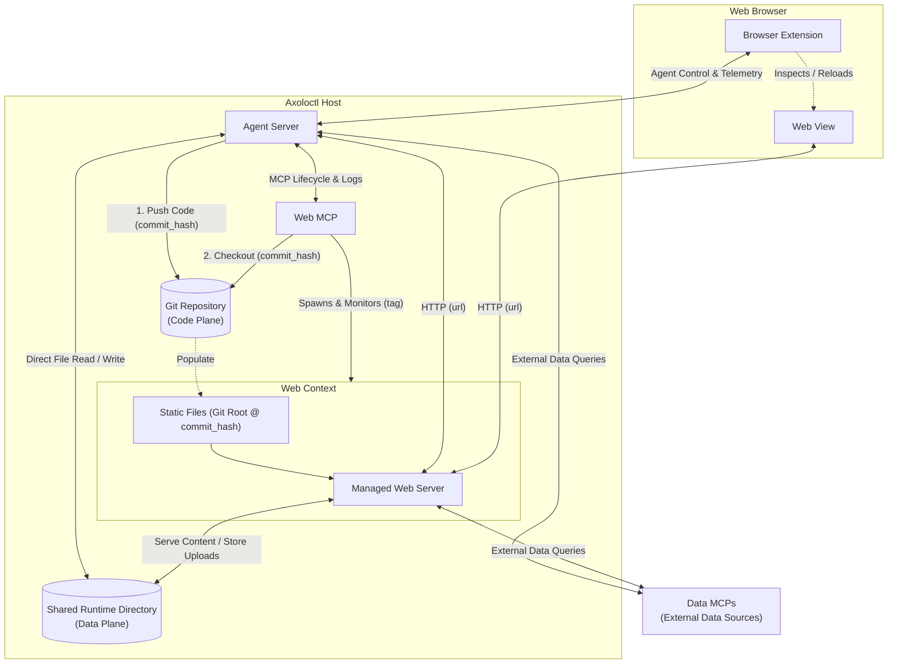
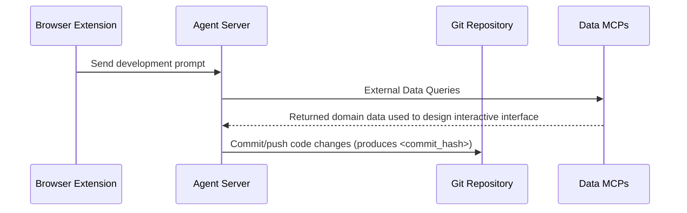
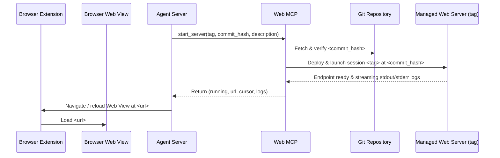
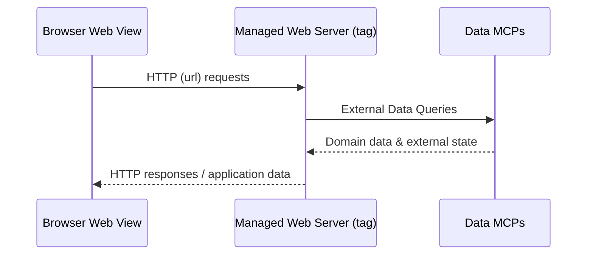
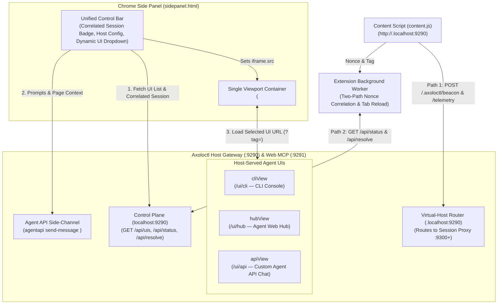

[**UDMI**](../../) / [**MCP**](../) / [Axoloctl](#)

# Axoloctl — Git-Backed Web Server Lifecycle MCP Server

`axoloctl` is a Model Context Protocol (MCP) server that enables an Agent to manage the lifecycle of one or more remote or local web server sessions in a deterministic, controlled environment.

Rather than running ad-hoc shell commands against a mutable working tree, the backing code for each web server is provided through an out-of-band Git mechanism. The Agent commits/pushes code changes to Git and calls `start_server(tag, commit_hash, description)`. `axoloctl` deploys that exact immutable revision under the specified `tag`, returns the immutable access `url`, manages the session lifecycle (`stop_server`, `get_status`, `list_servers`), and streams back the session's web server logs (`read_logs`).

---

## Objective

1. **Multi-Session Lifecycle Management**: Address each web server session by a caller-supplied `tag` and list active sessions with their `tag` and human-readable `description`.
2. **Immutable Code Deployment via Git Hash**: Deploy an explicit, verifiable Git commit SHA (`commit_hash`) fetched from the backing repository, queryable via `get_status`.
3. **Immutable Access URL on Startup**: Return the complete, immutable access `url` exclusively from `start_server` when a session is launched.
4. **Structured Log Streaming**: Allow the Agent to incrementally read and stream `stdout`/`stderr` logs for a specific `tag` using cursor-based pagination.

---

## Theory of Operation

`axoloctl` is designed around a collaborative workflow where the **Agent** serves as the operator's primary entry point for investigation and workflow discovery, and progressively transitions high-volume execution into a custom-built, tabular **Web View**:

1. **Conversational Discovery & Single-Example Triage**:
   The operator begins by working directly with the Agent in chat to describe an operational goal or diagnose an initial problem. During this preliminary phase, the Agent queries the external **Data MCPs** (`butler`, `barbican`, `uufi`) to verify that the necessary data is available, confirm how records across services correlate, and walk through a concrete single-device or small-sample example with the operator.
2. **Shaping the Interface Through Dialogue**:
   While conversational chat is ideal for open-ended reasoning and rapid diagnosis on a single example, it scales poorly when inspecting or acting upon thousands of IoT devices. As the operator and Agent iterate on the initial example—identifying which device attributes matter, what filter criteria isolate the target cohort, and how reported state should be compared against target configuration—those exact decisions define the specification for a scalable graphical utility.
3. **Background Synthesis of the Tabular Web Interface**:
   Once the data structure and workflow are validated on the representative example, the Agent automatically constructs or updates a custom web interface in the background. This web application translates the conversational workflow into a purpose-built tabular interface capable of filtering, correlating, and managing the entire fleet.
4. **Automated Testing, Deployment & Live Handoff**:
   Before exposing any changes to the operator, the Agent validates the web server code against both backend unit tests and end-to-end Playwright browser tests. Once all tests pass, the Agent commits and pushes the code to the local Git repository, deploys the immutable revision via `start_server(tag, commit_hash, description)`, verifies clean runtime logs via `read_logs`, and notifies the operator that the graphical interface is live and ready to scale their workflow across the full system.

---

## Critical User Journeys (CUJs)

The following Critical User Journeys describe the core operator goals and workflows for managing large-scale tables of IoT devices (see [GUMMI.md](../../gummi/GUMMI.md)):

1. **Portfolio Triage & Custom Alert Visualization**
   > *"In order to **rapidly identify and prioritize offline or misbehaving IoT devices across multiple sites**, as a **Fleet Operations Manager**, I need to **request a custom summary view of fleet health grouped by site and error severity and immediately explore the resulting breakdown**."*

2. **Multi-Attribute Fleet Filtering & Exploration**
   > *"In order to **isolate a specific cohort of devices across a fleet of hundreds of thousands of units**, as a **Site Reliability Engineer**, I need to **define custom filtering criteria and tabular columns over device attributes (such as site, hardware model, firmware version, and device prefix) and interactively browse the matching devices**."*

3. **Single-Device Configuration Drift Diagnosis**
   > *"In order to **diagnose why a specific field device is not converging to its intended operating parameters**, as a **Field Controls Technician**, I need to **inspect a side-by-side comparison of the device's reported state against its target configuration, identify discrepancies, and submit a validated configuration update**."*

4. **Staged Bulk Configuration Rollout**
   > *"In order to **safely apply a configuration change across a targeted group of devices without risking a fleet-wide disruption**, as a **Deployment Engineer**, I need to **select a filtered subset of devices, declare their target configuration, and monitor real-time convergence across the cohort**."*

5. **Site Discovery Reconciliation & Onboarding**
   > *"In order to **reconcile newly discovered field devices and telemetry points against the existing site inventory**, as an **Onboarding Specialist**, I need to **import external discovery datasets, match and review proposed device mappings in a tailored workspace, and iteratively refine the view without losing my in-progress onboarding state**."*

---

## System Architecture

The `axoloctl` system separates the **Code Plane** (immutable web server code and static assets delivered via Git `commit_hash` via the internal **Web MCP**) from the **Data Plane** (a dynamic **Shared Runtime Directory** inside the **Axoloctl Host** paired with external **Data MCPs** representing external data sources):


```mermaid
flowchart TD
  subgraph Browser["Web Browser"]
    direction LR
    Extension["Browser Extension"]
    WebView["Web View"]
    Extension -. "Inspects / Reloads" .-> WebView
  end

  subgraph AxoloctlHost["Axoloctl Host"]
    direction TB
    Agent["Agent Server"]
    WebMCP["Web MCP"]
    Git[("Git Repository\n(Code Plane)")]
    SharedDir[("Shared Runtime Directory\n(Data Plane)")]

    subgraph WebContext["Web Context"]
      direction TB
      StaticRoot["Static Files (Git Root @ commit_hash)"]
      WebServer["Managed Web Server"]
      StaticRoot --> WebServer
    end

    Agent <-->|"MCP Lifecycle & Logs"| WebMCP
    WebMCP -->|"Spawns & Monitors (tag)"| WebContext
    Agent <-->|"HTTP (url)"| WebServer
    Agent -->|"1. Push Code (commit_hash)"| Git
    WebMCP -->|"2. Checkout (commit_hash)"| Git
    Git -.->|"Populate"| StaticRoot
    Agent <-->|"Direct File Read / Write"| SharedDir
    WebServer <-->|"Serve Content / Store Uploads"| SharedDir
  end

  DataMCP["Data MCPs\n(External Data Sources)"]

  Extension <-->|"Agent Control & Telemetry"| Agent
  WebView <-->|"HTTP (url)"| WebServer
  Agent <-->|"External Data Queries"| DataMCP
  WebServer <-->|"External Data Queries"| DataMCP
```

### Code Plane vs. Data Plane

The web server environment is partitioned into two distinct planes:

1. **Code Plane — Static Files (`Git Root @ commit_hash`)**:
   * Corresponds to the root of the Git repository hierarchy where the web server application and static assets live.
   * Provisioned immutably by the **Web MCP** (`axoloctl`) when `start_server(tag, commit_hash, description)` checks out the target `commit_hash`.
   * Modifying the web server logic or static bundle requires committing to Git and passing the new `commit_hash` to `start_server`.
2. **Data Plane — Shared Runtime Directory & External Data MCPs**:
   * **Shared Runtime Directory**: A dynamic runtime directory mounted/shared between the **Agent Server** and the **Managed Web Server** inside the **Axoloctl Host**.
     * **Agent $\rightarrow$ Web Server**: The **Agent Server** can directly create or update files in the shared runtime directory (including data fetched from external **Data MCPs**) so the **Managed Web Server** immediately serves dynamic content without requiring a Git commit or server restart.
     * **Web Server $\rightarrow$ Agent**: Files uploaded or generated via the **Managed Web Server** (e.g., user uploads from the **Web View**) are written to the shared runtime directory where the **Agent Server** can directly read and process them.
   * **Data MCPs (`External Data Sources`)**: External MCP servers located outside the **Axoloctl Host** that provide both the **Agent Server** and the **Managed Web Server** with access to external data sources, APIs, and domain services.

### Components

* **Axoloctl Host**:
  * **Agent Server**: Queries external data sources via the **Data MCPs**, commits/pushes application code changes to the Git repository (**Code Plane**), reads/writes dynamic artifacts in the **Shared Runtime Directory** (**Data Plane**), manages the web server lifecycle through the **Web MCP**, connects to the **Managed Web Server** over `HTTP (url)`, and communicates with the **Browser Extension**.
  * **Web MCP (`axoloctl`)**: Fetches the requested `commit_hash` from Git and manages the **Web Context** for each session `tag`.
  * **Web Context**: Isolated runtime context managed by the **Web MCP** that binds the immutable **Static Files (`Git Root @ commit_hash`)** and the dynamic **Shared Runtime Directory** to the **Managed Web Server** (`HTTP (url)` endpoint for both the **Agent Server** and the **Web View**, with direct connectivity to external **Data MCPs**).
* **Data MCPs (`External Data Sources`)**: External MCP interfaces providing domain data and external system state to both the **Agent Server** and the **Managed Web Server**.
* **Web Browser**:
  * **Web View**: Connects to the **Managed Web Server** over `HTTP (url)` to render the web application and upload/download data-plane content.
  * **Browser Extension**: Connects directly to the **Agent Server** to coordinate browser navigation, page reloads, and client-side telemetry on the **Web View**.

---

## Lifecycle Workflow

### 1. Development


```mermaid
sequenceDiagram
  participant Ext as Browser Extension
  participant Agent as Agent Server
  participant Git as Git Repository
  participant DataMCP as Data MCPs

  Ext->>Agent: Send development prompt
  Agent->>DataMCP: External Data Queries
  DataMCP-->>Agent: Returned domain data used to design interactive interface
  Agent->>Git: Commit/push code changes (produces <commit_hash>)
```

### 2. Deployment


```mermaid
sequenceDiagram
  participant Ext as Browser Extension
  participant View as Browser Web View
  participant Agent as Agent Server
  participant WebMCP as Web MCP
  participant Git as Git Repository
  participant Web as Managed Web Server (tag)

  Agent->>WebMCP: start_server(tag, commit_hash, description)
  WebMCP->>Git: Fetch & verify <commit_hash>
  WebMCP->>Web: Deploy & launch session <tag> at <commit_hash>
  Web-->>WebMCP: Endpoint ready & streaming stdout/stderr logs
  WebMCP-->>Agent: Return (running, url, cursor, logs)
  Agent->>Ext: Navigate / reload Web View at <url>
  Ext->>View: Load <url>
```

### 3. Ongoing Use


```mermaid
sequenceDiagram
  participant View as Browser Web View
  participant Web as Managed Web Server (tag)
  participant DataMCP as Data MCPs

  View->>Web: HTTP (url) requests
  Web->>DataMCP: External Data Queries
  DataMCP-->>Web: Domain data & external state
  Web-->>View: HTTP responses / application data
```

---

## MCP Tool Interface

Each **Agent Server** is paired `1:1` with a single **Managed Web Server** session via `AXOLOCTL_TAG` (transmitted via the `X-Axoloctl-Tag` header to `Web MCP`). The Agent's `axoloctl` MCP tools (`start_server`, `stop_server`, `get_status`, `read_logs`) operate directly on its paired session without accepting a `tag` parameter in `inputSchema`:

### 1. `start_server`
Deploys the specified Git commit hash from the configured repository (`repo_path`) for the Agent's bound `AXOLOCTL_TAG` session, ensures the session's isolated Git worktree (`var/axoloctl/sessions/<tag>/workspace` on branch `axoloctl-<tag>`) and dedicated Agent window (`udmi_axoloctl_agent:<tag>`) are provisioned, and starts the web server via the configured `entrypoint` inside `app_subpath`. If the session is already running, `start_server` cleanly stops the existing web server instance before starting the new revision on the same sticky port and virtual-host `url` (`http://<tag>.localhost:<host_port>`).

* **Arguments**:
  * `commit_hash` (`string`, **required**): The 40-character hexadecimal Git commit SHA (`^[0-9a-f]{40}$`) of the code to run.
  * `description` (`string`, **required**): Human-readable description of the web server session (returned by `list_servers`).
* **Returns**:
  * `running` (`boolean`): `true` when the web server session passes the readiness probe (`HTTP GET <url>` status `< 500`); `false` if startup fails or times out.
  * `agent_running` (`boolean`): `true` when the paired `udmi_axoloctl_agent:<tag>` workspace window is active.
  * `workspace` (`string`): Absolute path to the Agent's isolated Git worktree directory (`var/axoloctl/sessions/<tag>/workspace/<app_subpath>`).
  * `url` (`string | null`): Complete, immutable, sticky virtual-host URL (`http://<tag>.localhost:<host_port>`) assigned to the session (returned only by `start_server`; `null` if startup fails).
  * `cursor` (`integer`): Initial log cursor position after startup.
  * `logs` (`string[]`): Initial startup log lines captured during launch (or failure diagnostics if `running` is `false`).

### 2. `stop_server`
Stops the running web server for the bound `AXOLOCTL_TAG` session while preserving its dedicated Agent window (`udmi_axoloctl_agent:<tag>`), isolated Git worktree (`var/axoloctl/sessions/<tag>/workspace`), **Shared Runtime Directory** (`<shared_root>/<tag>/`), and sticky port assignment for future restarts.

* **Arguments**: None (`{}`)
* **Returns**:
  * `running` (`boolean`): `false`.
  * `agent_running` (`boolean`): Whether the paired `udmi_axoloctl_agent:<tag>` window remains active.
  * `exit_code` (`integer | null`): Exit status code of the terminated server session.
  * `logs` (`string[]`): Trailing log lines emitted during shutdown.

### 3. `get_status`
Returns the current lifecycle state, Agent window status, worktree path, and deployed `commit_hash` of the bound `AXOLOCTL_TAG` session.

* **Arguments**: None (`{}`)
* **Returns**:
  * `running` (`boolean`): Whether the web server session is currently active.
  * `agent_running` (`boolean`): Whether the paired `udmi_axoloctl_agent:<tag>` window is currently active.
  * `workspace` (`string`): Absolute path to the Agent's isolated Git worktree directory.
  * `commit_hash` (`string`): Git commit SHA of the session (returned only by `get_status`).
  * `exit_code` (`integer | null`): Exit status code if the server session has stopped.

### 4. `list_servers`
Lists all currently active remote web server sessions across the host.

* **Arguments**: None (`{}`)
* **Returns**:
  * `servers` (`object[]`): Array of active server session summaries, each containing:
    * `tag` (`string`): Session identifier.
    * `description` (`string`): Description provided when the session was started.
    * `agent_running` (`boolean`): Whether the paired Agent window is active.
    * `workspace` (`string`): Path to the session's isolated Agent worktree.

### 5. `read_logs`
Streams captured unified log lines (`[server]` `stdout`/`stderr` from the configured `entrypoint` and `[browser]` client-side console/runtime errors forwarded from the **Web View**) for the bound `AXOLOCTL_TAG` session starting from a line offset cursor.

* **Arguments**:
  * `cursor` (`integer`, optional, default `0`): Zero-based line offset returned as `next_cursor` (or `cursor` from `start_server`) from a previous call.
  * `max_lines` (`integer`, optional, default `200`): Maximum number of log lines to return in a single call.
* **Returns**:
  * `running` (`boolean`): Whether the web server session is currently active.
  * `lines` (`string[]`): Unified `[server]` and `[browser]` log lines from `cursor` up to `cursor + max_lines`.
  * `next_cursor` (`integer`): Updated cursor offset for subsequent incremental `read_logs` calls.

---

## Runtime & Boundary Specifications

### 1. Explicit Configuration Contract (No Implicit Project Defaults)
`axoloctl` is project-agnostic and requires an explicit JSON configuration file passed to [`bin/tmux_axoloctl`](../../bin/tmux_axoloctl) (and [`bin/mcp_axoloctl`](../../bin/mcp_axoloctl) / [`web_mcp.py`](src/web_mcp.py) / [`ui_host.py`](src/ui_host.py)). If the configuration file or any required key is omitted, `axoloctl` fails immediately.

Required configuration keys (see example [`etc/gummi_config.json`](etc/gummi_config.json)):
* `repo_path`: Path to the existing Git repository containing the target web application (e.g., `"."` for the UDMI repository root).
* `app_subpath`: Subdirectory within `repo_path` where the web application resides (e.g., `"gummi"` or `"ui"`).
* `entrypoint`: Executable server command relative to `app_subpath` (e.g., `"bin/gummi"` or `"bin/serve"`).
* `port_env_var` *(optional)*: Additional application-specific port environment variable to export alongside `AXOLOCTL_PORT` (e.g., `"GUMMI_PORT"`).
* `host_port`: TCP port for the Host UI gateway and HTTP-to-MCP proxy (e.g., `9290`).
* `webmcp_port`: TCP port for the `Web MCP` lifecycle daemon (e.g., `9291`).
* `session_port_base`: Starting TCP port for sticky per-`tag` **Managed Web Server** instances (e.g., `9300`).
* `mcp_config`: Path to the unified MCP server registry file (e.g., [`mcp/axoloctl/etc/mcp_config.json`](etc/mcp_config.json)).
* `uis`: Host UI discovery catalog (`default_ui` and `items` array defining `id`, `label`, and `path`).

### 2. Web Context Execution Contract
* **Read-Only Code Plane**: When `start_server(tag, commit_hash, description)` is invoked, `Web MCP` verifies that `<commit_hash>` exists in `repo_path`, extracts the revision into an isolated session code directory (`var/axoloctl/sessions/<tag>/code`), and marks the source tree read-only (`chmod -R a-w`).
* **Configured Entrypoint (`<app_subpath>/<entrypoint>`)**: `Web MCP` verifies that `code/<app_subpath>/<entrypoint>` exists and is executable, changes directory to `code/<app_subpath>`, and executes `./<entrypoint>`. If the entrypoint is missing or not executable, `start_server` fails immediately.
* **Environment Variables**: `Web MCP` injects the following canonical environment variables into the server process:
  * `AXOLOCTL_PORT` (and optional `port_env_var`): Local TCP port assigned to `tag`.
  * `AXOLOCTL_DATA_DIR`: Absolute path to the session's persistent **Shared Runtime Directory** (`var/axoloctl/shared/<tag>/`).
  * `AXOLOCTL_MCP_PROXY_URL`: Base HTTP URL of the host's local HTTP-to-MCP proxy (`http://127.0.0.1:<host_port>`).
  * `AXOLOCTL_TAG`: Active session identifier (`tag`).
  * `AXOLOCTL_COMMIT`: Deployed 40-character hexadecimal Git commit SHA (`commit_hash`).

### 3. Single-Port Virtual-Host Routing (`<tag>.localhost:<host_port>`) & Sticky Internal Ports
* **Configured Unprivileged Port Layout** (as defined in [`etc/gummi_config.json`](etc/gummi_config.json)):
  * **`9290` (`host_port`)**: Unified **Axoloctl Host & Virtual-Host Gateway** serving:
    * **Control Plane (`http://localhost:9290`)**: Host UI discovery (`GET /api/uis`), Agent UIs (`/ui/cli`, `/ui/hub`, `/ui/api`), session status/resolution (`GET /api/status`, `GET /api/resolve`), and HTTP-to-MCP proxy (`AXOLOCTL_MCP_PROXY_URL`).
    * **Session Virtual Hosts (`http://<tag>.localhost:9290`)**: Hostname-routed reverse proxy that multiplexes all active **Managed Web Server** sessions (`gummi.localhost:9290`, `alpha.localhost:9290`, etc.) over the single `:9290` port while providing full browser origin isolation (separate HTTP/memory caches, `localStorage`, cookies, and Service Workers per `tag`).
  * **`9291` (`webmcp_port`)**: Fixed internal offset for the `Web MCP` lifecycle daemon (`GET /status`, `GET /resolve`, `POST /telemetry`).
  * **`9300+` (`session_port_base`)**: Sequential internal loopback range for sticky per-`tag` `session_proxy.py` instances, persisted in `var/axoloctl/sessions/ports.json`.
* Each session `tag` is assigned a canonical virtual-host `url` (`http://<tag>.localhost:<host_port>`) and internal loopback port that remain constant across `start_server` redeployments and across `stop_server` / restart cycles for the same `tag`.
* Keeping the virtual-host origin (`http://<tag>.localhost:<host_port>`) invariant across iterative commits preserves browser state (`localStorage`, session cookies, DevTools state), allows the **Browser Extension** to reload the **Web View** in place, and requires only a **single port (`9290`)** to be forwarded over SSH or remote development tunnels.

### 4. Per-Tag Shared Runtime Directory (`Data Plane`) Lifecycle
* The **Shared Runtime Directory** is scoped per session `tag` at `var/axoloctl/shared/<tag>/` and exposed to both the **Agent Server** and the **Managed Web Server** (`AXOLOCTL_DATA_DIR`).
* **Persistence**: Contents of `var/axoloctl/shared/<tag>/` are preserved across `start_server` code redeployments (which replace only the read-only `code/` directory) and across `stop_server(tag)` invocations, ensuring uploaded files, cached query results, and application state survive iterative development.

### 5. Data MCP Connectivity (`AXOLOCTL_MCP_PROXY_URL`)
* To allow both the **Agent Server** and the **Managed Web Server** to query external **Data MCPs** concurrently without `stdio` pipe contention or requiring an MCP client SDK inside every web app, the **Axoloctl Host** exposes a local HTTP-to-MCP bridge at `AXOLOCTL_MCP_PROXY_URL`.
* The **Managed Web Server** invokes **Data MCP** tools via standard HTTP JSON requests (`POST ${AXOLOCTL_MCP_PROXY_URL}/mcp/<mcp_server>/<tool_name>`) and receives structured JSON responses.

### 6. Readiness Probe & Startup Failure Semantics
* After spawning `./<entrypoint>`, `Web MCP` polls `HTTP GET` on the session proxy (succeeding on any HTTP status `< 500`) for up to a fixed startup timeout (`10 seconds`) while monitoring the session window.
* If the process exits prematurely or fails to respond with HTTP `< 500` within `10 seconds`, `Web MCP` terminates the session window and returns `{ running: false, url: null, cursor, logs }` containing the captured `stdout`/`stderr` output so the **Agent Server** can immediately diagnose the startup failure.

### 7. Browser Extension Integration, Single-Port Virtual Hosts & Two-Path Nonce Correlation
* **Single-Port Virtual-Host Multiplexing (`ui_host.py` $\rightarrow$ `session_proxy.py`)**: All browser traffic for both the Control Plane (`localhost:9290`) and every managed session (`<tag>.localhost:9290`) enters through `ui_host.py` on `:9290`. When `ui_host.py` receives a request with `Host: <tag>.localhost:<port>`, it reverse-proxies the request to that session's `session_proxy.py` (`9300+`), which in turn intercepts `/.axoloctl/*` control paths and proxies application traffic (including streaming `text/event-stream` SSE) to `./<entrypoint>`.
* **Two-Path Nonce Correlation (Opaque Port-Forwarding Safe)**:
  1. **Path 1 (Web Viewer Origin `http://<tag>.localhost:<port>` $\rightarrow$ Session Proxy)**: When a page loads in the browser, `content.js` generates a cryptographic per-tab `nonce` and sends `POST /.axoloctl/beacon` to `window.location.origin`. If the origin is an `axoloctl`-managed session, `session_proxy.py` records the `nonce` in `var/axoloctl/sessions/<tag>/beacons.json` and returns `{ axoloctl: true, tag, commit_hash, description, nonce }`.
  2. **Path 2 (Extension Service Worker $\rightarrow$ Control Plane `http://localhost:<port>`)**: `background.js` queries the Axoloctl Host control plane (`GET /api/status` and `GET /api/resolve?nonce=<nonce>`), which proxies to `Web MCP` (`:9291`) to verify the `nonce` and correlate the browser tab to its exact backend `tag` and `commit`—even when the browser runs on a remote machine behind opaque SSH/cloud port forwarding with multiple concurrent tagged sessions.
* **Control Channel & Commit-Driven Reload**: When `start_server` deploys a new commit for a session `tag`, `beacons.json` is preserved across the restart. `background.js` detects the `commit` transition for the correlated `tag` via `GET /api/status` and reloads the matching browser tab (`chrome.tabs.reload(tabId)`).
* **Viewer-Origin Unified Telemetry (`[server]` + `[browser]`)**: Client-side runtime errors (`console.error`, uncaught exceptions, unhandled rejections) captured from verified **Web View** tabs are posted directly to the viewer's own virtual-host origin (`POST /.axoloctl/telemetry`), where `session_proxy.py` appends `[browser]` lines into `var/axoloctl/sessions/<tag>/unified.log` alongside `[server]` `stdout`/`stderr` output.

---

## Browser Extension $\leftrightarrow$ Agent Server Integration

The **Browser Extension** is a **static Chrome Extension (Manifest V3 Side Panel)** designed to provide a clean, user-friendly interface without exposing developer-only tools (such as Chrome DevTools) and without ever requiring updates when the **Managed Web Server** application pages or the **Agent UIs** evolve.

Rather than hardcoding specific UI implementations inside the extension bundle, the **Axoloctl Host** exposes a dynamic catalog of available Agent UIs (`GET /api/uis` — e.g., `{ cliView, hubView, apiView }`), and the Chrome Side Panel renders a dynamic dropdown selector and active session correlation badge above a **single `<iframe id="agent-viewport">`**.


```mermaid
flowchart TB
  subgraph SidePanel["Chrome Side Panel (sidepanel.html)"]
    direction TB
    Header["Unified Control Bar\n(Correlated Session Badge, Host Config, Dynamic UI Dropdown)"]
    Viewport["Single Viewport Container\n(<iframe id='agent-viewport' src='...?tag=<tag>&nonce=<nonce>'>)"]
    Header -->|"Sets iframe.src"| Viewport
  end

  ContentScript["Content Script (content.js)\n(http://<tag>.localhost:9290)"]
  BgWorker["Extension Background Worker\n(Two-Path Nonce Correlation & Tab Reload)"]

  subgraph Host["Axoloctl Host Gateway (:9290) & Web MCP (:9291)"]
    direction TB
    UIRegistry["Control Plane (localhost:9290)\n(GET /api/uis, /api/status, /api/resolve)"]
    VHostRouter["Virtual-Host Router (<tag>.localhost:9290)\n(Routes to Session Proxy :9300+)"]
    AgentAPI["Agent API Side-Channel\n(agentapi send-message <conv-id>)"]

    subgraph HostUIs["Host-Served Agent UIs"]
      direction LR
      CLIView["cliView\n(/ui/cli — CLI Console)"]
      HubView["hubView\n(/ui/hub — Agent Web Hub)"]
      APIView["apiView\n(/ui/api — Custom Agent API Chat)"]
    end
  end

  ContentScript -->|"Path 1: POST /.axoloctl/beacon & /telemetry"| VHostRouter
  ContentScript -->|"Nonce & Tag"| BgWorker
  BgWorker <-->|"Path 2: GET /api/status & /api/resolve"| UIRegistry
  Header -->|"1. Fetch UI List & Correlated Session"| UIRegistry
  Header -->|"2. Prompts & Page Context"| AgentAPI
  Viewport <-->|"3. Load Selected UI URL (?tag=<tag>)"| HostUIs
```

### 1. Invariant Extension Layer (Shared Across All UIs)
Because the Chrome Extension only hosts the control bar, the single `<iframe id="agent-viewport">`, and the background service worker, three core mechanisms operate identically regardless of which UI is selected:
1. **Dynamic UI Discovery (`GET /api/uis`)**:
   * On startup, the Side Panel fetches the list of available UIs from the **Axoloctl Host**:
     ```json
     {
       "default_ui": "cliView",
       "uis": [
         { "id": "cliView", "label": "CLI Console", "url": "http://localhost:9290/ui/cli" },
         { "id": "hubView", "label": "Web Hub", "url": "http://localhost:9290/ui/hub" },
         { "id": "apiView", "label": "Custom Chat (Agent API)", "url": "http://localhost:9290/ui/api" }
       ]
     }
     ```
   * The extension populates its `<select>` dropdown from `uis` and binds the selected entry's `url` (appending `?tag=<correlated_tag>&nonce=<nonce>`) directly to `<iframe id="agent-viewport">`. If `uis` contains only a single entry (`uis.length === 1`), the dropdown selector is automatically hidden and that single UI candidate is loaded directly. Adding, removing, or modifying a UI on the host requires **zero changes to the Chrome Extension**.
2. **`agentapi` Side-Channel (`agentapi send-message <conversation-id>`)**:
   * All host-served UIs (`cliView`, `hubView`, `apiView`) attach to the same active `<conversation-id>` on the **Agent Server**.
   * When the extension's control bar sends page context or prompts via the `agentapi` side-channel, the active conversation updates immediately in whichever UI is currently loaded in the `<iframe>`.
3. **Two-Path Nonce Correlation, Automatic Tab Reload & `[browser]` Error Capture**:
   * `content.js` registers a cryptographic `nonce` via `POST /.axoloctl/beacon` on the Web Viewer's origin (Path 1) and streams client-side `console.error` / uncaught exceptions to `POST /.axoloctl/telemetry` (`[browser]` prefix in `read_logs(tag)`).
   * `background.js` verifies the tab's `nonce` and `tag` against the Axoloctl Host (`GET /api/status` and `GET /api/resolve?nonce=<nonce>` on Path 2) and automatically reloads the correlated **Web View** tab whenever `start_server` deploys a new commit for that `tag`.

### 2. Pluggable Host-Served UI Implementations (`{ cliView, hubView, apiView }`)

| UI ID | Host Endpoint | Underlying Mechanism | Strengths |
| :--- | :--- | :--- | :--- |
| **`cliView`** | `/ui/cli?tag=<tag>` | Host serves the CLI console status page for `udmi_axoloctl_agent:<tag>`. | Focused view of the session's isolated Git worktree, branch (`axoloctl-<tag>`), and CLI terminal attachment. |
| **`hubView`** | `/ui/hub?tag=<tag>` | Host serves the Agent Web Hub overview with active session links and MCP server status. | Central overview of deployed web views, Agent windows, and registered MCP servers. |
| **`apiView`** | `/ui/api?tag=<tag>` | Host serves a streamlined, custom HTML/JS chat page powered by the **Agent API** for `<tag>`. | Purpose-built, simplified user interface tailored specifically for non-developer audiences. |

---

## Agentic Web Application Engineering & Verification

While the [Theory of Operation](#theory-of-operation) describes the human-facing workflow, this section defines how the active **Agent** pragmatically engineers, tests, and deploys web server code. Authoritative operational rules for the Agent are maintained in [`AGENTS.md`](AGENTS.md).

### 1. Data MCP Probing & Schema Discovery

Before writing or modifying any web server code, the Agent directly queries the external **Data MCPs** (`butler`, `barbican`, `uufi`) during the initial chat session with the operator to:
* Inspect the exact structure, column names, nested JSON paths, and data types returned by the MCP tools.
* Verify that the target records exist and test candidate filter predicates, joins, and correlations on a concrete sample device or site.
* Use the operator's conversational feedback (which filters are needed, how columns should be grouped or compared, and what actions should be exposed) as the specification for the web application's backend API routes and tabular frontend columns.

### 2. Background Web Application Synthesis

While working through the preliminary example with the operator in chat, the Agent delegates or executes web application construction in the background inside its isolated per-tag Git worktree (`var/axoloctl/sessions/<tag>/workspace/<app_subpath>` on branch `axoloctl-<tag>`) so conversational interaction remains responsive and concurrent tagged sessions never collide:
* **Server-Side Tabular Processing**: The web server queries the **Data MCPs** through `AXOLOCTL_MCP_PROXY_URL` (`POST /mcp/<server_name>/<tool_name>`) or reads staged datasets in `AXOLOCTL_DATA_DIR`, performing all filtering, multi-source correlation, sorting, and pagination (`LIMIT` / `OFFSET`) on the server rather than shipping unbounded fleet tables to the browser.
* **Code vs. Data Plane Separation**: All code and templates are committed to the session's Git worktree branch (`axoloctl-<tag>`) and started via `./<entrypoint>` on `AXOLOCTL_PORT`. All mutable state (SQLite databases, user filter presets, staging imports) is written exclusively to `AXOLOCTL_DATA_DIR`.

### 3. Mandatory Verification Gate (Unit + Playwright E2E Tests)

No web server revision may be committed or deployed via `start_server` until it passes both automated test tiers in the Agent's worktree (`var/axoloctl/sessions/<tag>/workspace/<app_subpath>`):

1. **Backend Unit Tests**:
   * Validate backend route handlers, MCP proxy payload parsing, filter/correlation logic, pagination bounds, and fail-fast error responses against representative fixture data.
2. **Playwright End-to-End Browser Tests**:
   * Launch the web application against an isolated test port and `AXOLOCTL_DATA_DIR`, and drive a headless Chromium instance via Playwright to verify the complete operator workflow:
     * Tabular columns render the expected device rows and correlated attributes.
     * Interactive filter controls, search inputs, and pagination update the rendered table state deterministically.
     * Detail views and mutation workflows (e.g., configuration diff inspection or staged rollouts) execute end-to-end.
     * Zero client-side `console.error` messages, uncaught `pageerror` exceptions, or HTTP `5xx` responses occur during test execution.

### 4. Git Deployment & Operator Handoff

Once both unit and Playwright test suites pass inside the Agent's worktree (`AXOLOCTL_TAG` is pre-exported in the Agent environment):

```bash
# 1. Run backend unit tests and Playwright E2E browser tests (example for gummi)
venv/bin/pytest gummi/tests/

# 2. Commit the verified revision to the session's Git worktree branch (axoloctl-<tag>)
git add -A
git commit -m "Add tabular view and filters for <workflow>"
COMMIT_HASH=$(git rev-parse HEAD)

# 3. Deploy via Web MCP (or CLI, using pre-bound AXOLOCTL_TAG)
bin/mcp_axoloctl start "$COMMIT_HASH" "Add tabular view and filters"
```

The Agent then inspects `read_logs()` (`bin/mcp_axoloctl logs`) to confirm zero `[server]` or `[browser]` startup errors, and notifies the operator in chat that the custom web utility is live at `url` (`http://<tag>.localhost:9290`, automatically reloaded in their **Browser Web View**).

---

## Local Development Setup

In a local UDMI development environment, `axoloctl` operates directly against the existing Git repository (configured via an explicit JSON config file such as [`mcp/axoloctl/etc/gummi_config.json`](etc/gummi_config.json)), the external **Data MCPs** are the standard UDMI MCP servers (`butler`, `barbican`, `uufi`), and process isolation is managed across **two dedicated `tmux` sessions** (`udmi_axoloctl_agent` and `udmi_axoloctl_web`), where each tagged session provisions a `1:1` pair of windows (`udmi_axoloctl_agent:<tag>` and `udmi_axoloctl_web:<tag>`).

### 1. Required Components Overview

1. **Explicit Axoloctl Configuration ([`mcp/axoloctl/etc/gummi_config.json`](etc/gummi_config.json))**:
   * Explicitly binds `repo_path` (`"."`), `app_subpath` (`"gummi"`), `entrypoint` (`"bin/gummi"`), `port_env_var` (`"GUMMI_PORT"`), ports (`9290`, `9291`, `9300`), `mcp_config` ([`mcp/axoloctl/etc/mcp_config.json`](etc/mcp_config.json)), and host UI endpoints (`/ui/cli`, `/ui/hub`, `/ui/api`).
   * To use `axoloctl` with a different web application (for example, an application in `ui/`), create or pass a config file pointing to that `repo_path`, `app_subpath`, and `entrypoint`.
2. **Unified MCP Server Registry ([`mcp/axoloctl/etc/mcp_config.json`](etc/mcp_config.json))**:
   * Registers `axoloctl` ([`bin/mcp_axoloctl`](../../bin/mcp_axoloctl)) alongside the UDMI **Data MCPs**: [`bin/mcp_butler`](../../bin/mcp_butler) (device inventory, state/config tables, managed rollouts), [`bin/mcp_barbican`](../../bin/mcp_barbican) (etcd/mosquitto/UDMIS state), and [`bin/mcp_uufi`](../../bin/mcp_uufi) (UUFI operations).
3. **On-Disk Runtime Layout (`$UDMI_ROOT/var/axoloctl/`)**:
   * `active_config.json`: Pointer to the active validated configuration file written by `bin/tmux_axoloctl start`.
   * `sessions/<tag>/workspace/`: Isolated per-tag Git worktree (on branch `axoloctl-<tag>`) where the paired **Agent** (`udmi_axoloctl_agent:<tag>`) edits, tests, and commits code without conflicting with other concurrent sessions.
   * `sessions/<tag>/code/`: Read-only (`chmod -R a-w`) archive of `<commit_hash>` extracted from `repo_path` by `Web MCP` on `start_server`.
   * `sessions/<tag>/unified.log`: Combined `[server]` and `[browser]` log stream read by `read_logs`.
   * `shared/<tag>/`: Persistent per-tag **Shared Runtime Directory** (`AXOLOCTL_DATA_DIR`) shared between that tag's **Agent Server** and **Managed Web Server**.
4. **Two Dedicated `axoloctl` `tmux` Sessions (with `1:1` Per-Tag Windows)**:
   * **`udmi_axoloctl_agent` (Agent Session)**:
     * `ui_host`: Runs the host gateway and virtual-host router on `host_port` (`9290`) serving `GET /api/uis`, the host Agent UIs (`/ui/cli`, `/ui/hub`, `/ui/api`), the HTTP-to-MCP proxy (`POST /mcp/<server>/<tool>`), and `<tag>.localhost:9290` reverse-proxying.
     * `<tag>` (e.g., `gummi`): Dedicated **Agent** workspace window per active session `tag` inside `var/axoloctl/sessions/<tag>/workspace/<app_subpath>` (branch `axoloctl-<tag>`) with `AXOLOCTL_TAG=<tag>`, `AXOLOCTL_DATA_DIR`, `AXOLOCTL_CONFIG`, and `MCP_CONFIG` exported.
   * **`udmi_axoloctl_web` (Web Server Session)**:
     * `web_mcp`: Runs the `axoloctl` **Web MCP** lifecycle daemon and browser reload/log collector on `webmcp_port` (`9291`).
     * `<tag>` (e.g., `gummi`): Dedicated **Managed Web Server** `tmux` window per active session `tag` executing `./<entrypoint>` inside `var/axoloctl/sessions/<tag>/code/<app_subpath>` behind `session_proxy.py` on its sticky internal port (`9300+`).
5. **Unpacked Chrome Extension**:
   * Loaded once in Chrome (`chrome://extensions` $\rightarrow$ *Developer mode* $\rightarrow$ *Load unpacked* pointing to `mcp/axoloctl/extension/`).

### 2. Step-by-Step Developer Bootstrap

```bash
# 1. Install base dependencies (unprivileged user-space default)
bin/setup_base

# 2. Start local UDMI infrastructure (Barbican & Butler) on unprivileged ports
bin/udmi start sites/udmi_site_model //mqtt/localhost:18833

# 3. Start the two axoloctl tmux sessions with an explicit configuration file
bin/tmux_axoloctl start mcp/axoloctl/etc/gummi_config.json //mqtt/localhost:18833

# 4. Deploy the current Git revision to provision the 1:1 Agent + Web Server pair for tag 'gummi'
COMMIT_HASH=$(git rev-parse HEAD)
bin/mcp_axoloctl --tag gummi start "$COMMIT_HASH" "Initial GUMMI web session"

# 5. Verify session status, logs, and virtual-host HTTP readiness (http://gummi.localhost:9290)
bin/mcp_axoloctl --tag gummi status
bin/mcp_axoloctl --tag gummi logs
curl -I http://gummi.localhost:9290/
```

### 3. CLI & `tmux` Inspection Reference

[`bin/mcp_axoloctl`](../../bin/mcp_axoloctl) operates both as a standard stdio MCP server (`bin/mcp_axoloctl mcp`) and as a direct CLI tool (reading `--tag <tag>` or `AXOLOCTL_TAG`):

```bash
bin/mcp_axoloctl --tag <tag> start <commit_hash> "<description>"
bin/mcp_axoloctl --tag <tag> status
bin/mcp_axoloctl list
bin/mcp_axoloctl --tag <tag> logs [--cursor 0] [--max-lines 200]
bin/mcp_axoloctl --tag <tag> stop
```

| Session Name | Windows | Purpose | Command to Inspect / Attach |
| :--- | :--- | :--- | :--- |
| **`udmi_axoloctl_agent`** | `ui_host`, `<tag>` | Runs the host gateway (`:9290`) and each session's dedicated **Agent** window (`<tag>` in `var/axoloctl/sessions/<tag>/workspace/<app_subpath>`). | `bin/tmux_axoloctl attach` |
| **`udmi_axoloctl_web`** | `web_mcp`, `<tag>` | Runs the **Web MCP** daemon (`:9291`) and each deployed **Managed Web Server** session window (`<tag>` on `:9300+`). | `bin/tmux_axoloctl attach web` |
| **`udmi_butler`** | `postgres`, `influxdb`, `butler`, `registrar` | Backing datastore and Butler service for [`bin/mcp_butler`](../../bin/mcp_butler). | `bin/tmux_butler status //mqtt/localhost:18833` |
| **`udmi_barbican`** | `mosquitto`, `etcd`, `udmis` | Backing MQTT broker, etcd state store, and UDMIS pipeline for [`bin/mcp_barbican`](../../bin/mcp_barbican). | `bin/tmux_barbican status //mqtt/localhost:18833` |

---

## Fail-Fast Guarantees

* **Mandatory Explicit Configuration**: Starting `bin/tmux_axoloctl`, `web_mcp.py`, or `ui_host.py` without an explicit, valid configuration file (or with any required key missing) fails immediately with a hard error. No implicit project defaults are assumed.
* **Mandatory 1:1 `AXOLOCTL_TAG` Binding**: Calling `start_server`, `stop_server`, `get_status`, or `read_logs` without a bound `AXOLOCTL_TAG` (`X-Axoloctl-Tag` header or `--tag <tag>`) or passing an ad-hoc `tag` argument inside `inputSchema` fails immediately with an error.
* **No Implicit Branch or `HEAD` Fallbacks**: `start_server` requires an explicit 40-character Git commit hash (`commit_hash`) that exists in `repo_path`. Symbolic refs (such as `HEAD` or branch names) and missing commits are rejected immediately with an error.
* **Mandatory Configured Entrypoint**: If the checked-out `commit_hash` does not contain an executable `<app_subpath>/<entrypoint>`, `start_server` fails immediately without falling back to generic static file serving.
* **Unknown Session Tag Rejection**: Calling `stop_server`, `get_status`, or `read_logs` for an unstarted `tag` fails immediately with an explicit error.
* **Startup Readiness Verification**: `start_server` verifies that the web server session responds to `HTTP GET <url>` (`status < 500`) within the `10s` startup timeout window; if startup fails, `start_server` terminates the process and returns `{ running: false, url: null, cursor, logs }`.
* **Explicit Stop Semantics**: Calling `stop_server` for a session whose web server is not currently running fails immediately with an explicit error rather than silently succeeding.
